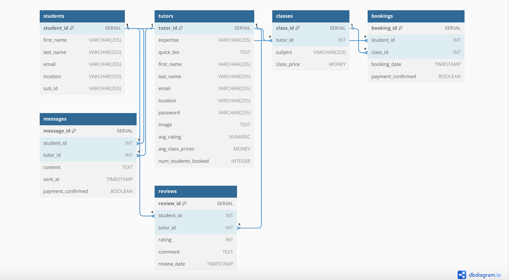

# About
LearningStation is single-page React App which connects students and tutors.

The project deployed at the address https://learning-station.vercel.app/ by using the following technologies:

1. [ElephantSql](https://Elephantsql) - manage our continuous integration process. We have connected CircleCI to GitHub so that it can listen for changes to the master branch. We update the keys to ensure that Elephantsql can also trigger an automatic deploy to the production branch.

2. [Render](https://render.com) - a service that simplifies the deployment process for web applications and takes care of the server configuration process.

3. [Vercel](https://vercel.com) - configured Vercel to watch the origin production branch and deploy the site automatically.

## Planning Process


### Users Stories
	Sign Up or Log In:

As a new user, I can sign up by providing my first name, last name, email, location, and subscription ID.
As a returning user, I can log in using my email and password.

	Explore Tutors:
Once logged in, I can browse through the list of available tutors.
I can view a tutor's expertise, quick bio, image, average rating, and class prices.

	Select a Tutor and Book a Class:
I can choose a tutor based on their expertise and ratings.
I click on a tutor's profile to view more details about them.
I see the list of classes they offer, including subjects and class prices.
I select a class that suits my needs and click the "Book Now" button.

	Confirm Booking:

I'm directed to a booking confirmation page.
I review the class details, including the subject, tutor, and class price.
I choose a convenient date and time for the class.
I confirm the booking by clicking the "Confirm" button.

	Provide Payment:
If the payment is required upfront, I'm prompted to provide payment details.
I securely provide my payment information and complete the payment process.

	Attend the Class:

On the scheduled date and time, I attend the tutoring class.
The tutor provides instruction and guidance during the session.

	Submit a Review:

After the class, I'm given the option to leave a review.
I rate the tutor's performance using a star rating system (1 to 5 stars).
I write a comment about my experience with the tutor.
I click the "Submit" button to share my review.

	Review Calculation:

After I submit the review, the platform automatically calculates the tutor's average rating based on all reviews.
The tutor's average rating is updated and displayed on their profile.

	Engage in Messaging:

I can also use the messaging feature to communicate with the tutor.
I click on the "Message" button on the tutor's profile.
I can ask questions or discuss class-related matters with the tutor.

	Access History:

I can access my booking history, including past and upcoming classes.
I can see the details of each class, payment status, and review status.

	Log Out:

When I'm done using the platform, I can log out to secure my account.


### WareFrame


### ERD



## Build with:
* ReatJS
* Node
* Express
* PosrgreSQL
* OpenAI
* Stripe
* sockets.io
* AuthO


## DEMO


## Stripe Testing

Use Credit Card # 4000 0012 4000 0000 for testing success scenarios.

More information in their docs: <https://stripe.com/docs/testing#cards>


The main important bit is that the React project has `proxy` set to `localhost:8080` in the `package.json` file, and that the Express app listens to port 8080 in `server.js`. Take a look!


## Running the project

You need **TWO** terminal windows/tabs for this (or some other plan for running two Node processes).

In one terminal, `cd` into `react-front-end`. Run `npm install` or `yarn` to install the dependencies. Then run `npm start` or `yarn start`, and go to `localhost:3000` in your browser. 

In the other terminal, `cd` into `express-back-end`. Run `npm install` or `yarn` to install the dependencies, then `npm start` or `yarn start` to launch the server. If you wish to use nodemon run `npm run local`.

### Database set up
Creating tables - when creating tables LEAVE BOOKINGS FOR LAST.

Seeding TABLES - When seeding LEAVE BOOKINGS SEEDS FOR LAST.

You need to create .env file inside the `express-back-end` directory, please take as an example from .env.example file
* Create a new database called learningstation. You will run psql to perform this operation :
``` psql
CREATE NEW DATABASE learningstation; 
```
Then connect to DB:
```  \c learningstation  ```


* Next step will be creating tables, an example below:
```
CREATE TABLE students (
  student_id SERIAL PRIMARY KEY NOT NULL,
  first_name VARCHAR(255) NOT NULL,
  last_name VARCHAR(255) NOT NULL,
  email VARCHAR(255) UNIQUE NOT NULL,
  location VARCHAR(255) NOT NULL,
  password VARCHAR(255) NOT NULL
);
```
* After creating tables you will need to seed tables

### OpenAI with React Set Up
* You will need to install the OpenAI SDK. This can be done by running the following command in root of front end folder:
```
npm install openai
```
* Building The Lesson Plan Writer. Create a .env file in the root of your front end folder and store your API key like:

```
REACT_APP_OPENAI_API_KEY = "Your API Key here"
```
* Next, you will need to install “dotenv” npm package, which will allow you to access the environment variables defined in the .env file.
```
npm install dotenv
```
* Then you can use the environment variable like:
```
process.env.REACT_APP_OPENAI_API_KEY

```
## Next steps

From here, you can start working on your project!

As soon as the dependencies are installed, your Express server can serve JSON and static assets (like images) in response to API calls from the React app. You can get started on developing your React app, routing plan, etc. right away! Any request that isn't handled by React is passed on to the Express server. That means that you can call a route like `/api/users` from React using `fetch`, `axios`, or something else, and Express will receive it as though they originated from the same app. For routing, best practice is to namespace all of your data routes to `/api`, so that they don't clash with other routing schemes, like React Router.


